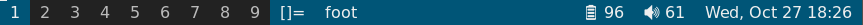

# somebar - dwm-like bar for dwl



The mailing list for this project is
[~raphi/public-inbox@lists.sr.ht](mailto:~raphi/public-inbox@lists.sr.ht).

## Dependencies

* c++ compiler, meson, and ninja
* wayland-scanner
* libwayland-client
* libwayland-cursor
* libcairo
* libpango
* libpangocairo

```
sudo apt install build-essential meson ninja-build \
    libwayland-bin libwayland-client0 libwayland-cursor0 libwayland-dev \
    libcairo2 libcairo2-dev \
    libpango-1.0-0 libpango1.0-dev libpangocairo-1.0-0

# or

sudo pacman -S base-devel meson \
    wayland wayland-protocols cairo pango
```

## Configuration

Copy `src/config.def.hpp` to `src/config.hpp`, and adjust if needed.

## Building

```
cp src/config.def.hpp src/config.hpp
meson setup build
ninja -C build
sudo ninja -C build install
```

## Usage

You must start somebar using dwl's `-s` flag, e.g. `dwl -s somebar`.

Somebar can be controlled by writing to `$XDG_RUNTIME_DIR/somebar-0`
or the path defined by `-s` argument.
The following commands are supported:

* `status TEXT`: Updates the status bar
* `hide MONITOR` Hides somebar on the specified monitor
* `show MONITOR` Shows somebar on the specified monitor
* `toggle MONITOR` Toggles somebar on the specified monitor

MONITOR is an zxdg_output_v1 name, which can be determined e.g. using `weston-info`.
Additionally, MONITOR can be `all` (all monitors) or `selected` (the monitor with focus).

Commands can be sent either by writing to the file name above, or equivalently by calling
somebar with the `-c` argument. For example: `somebar -c toggle all`. This is recommended
for shell scripts, as there is no race-free way to write to a file only if it exists.

The maintainer of somebar also maintains
[someblocks](https://git.sr.ht/~raphi/someblocks/),
a fork of [dwmblocks](https://github.com/torrinfail/dwmblocks) that outputs
to somebar instead of dwm's bar.

## IPC

Out of the box, somebar cannot control dwl. Clicking on the tag bar has no
effect, because there is no communication channel from somebar back to dwl.

If you apply the patch `contrib/ipc.patch`, then somebar will

1. Not read stdin anymore, and instead use a wayland extension to read dwl's
   state. This means you must close stdin yourself, if you choose to launch
   somebar using dwl's -s flag.
2. somebar can use the same wayland extension to send commands back to dwl.
   This means that clicking on tags will switch to that tag (this can of course
   be customized in config.h).

If you apply the IPC patch to somebar, then
**dwl must have the [wayland-ipc patch](https://git.sr.ht/~raphi/dwl/blob/master/patches/wayland-ipc.patch) applied too**,
since dwl must implement the wayland extension too.

## Other patches

Like all suckless software, somebar can be customized via patches. You can find some patches in the contrib folder with descriptions written in them.

## License

somebar - dwm-like bar for dwl

Copyright (c) 2021 Raphael Robatsch

Permission is hereby granted, free of charge, to any person obtaining a copy of
this software and associated documentation files (the "Software"), to deal in
the Software without restriction, including without limitation the rights to
use, copy, modify, merge, publish, distribute, sublicense, and/or sell copies
of the Software, and to permit persons to whom the Software is furnished to do
so, subject to the following conditions:

The above copyright notice and this permission notice (including the next
paragraph) shall be included in all copies or substantial portions of the
Software.

THE SOFTWARE IS PROVIDED "AS IS", WITHOUT WARRANTY OF ANY KIND, EXPRESS OR
IMPLIED, INCLUDING BUT NOT LIMITED TO THE WARRANTIES OF MERCHANTABILITY,
FITNESS FOR A PARTICULAR PURPOSE AND NONINFRINGEMENT. IN NO EVENT SHALL THE
AUTHORS OR COPYRIGHT HOLDERS BE LIABLE FOR ANY CLAIM, DAMAGES OR OTHER
LIABILITY, WHETHER IN AN ACTION OF CONTRACT, TORT OR OTHERWISE, ARISING FROM,
OUT OF OR IN CONNECTION WITH THE SOFTWARE OR THE USE OR OTHER DEALINGS IN THE
SOFTWARE.
