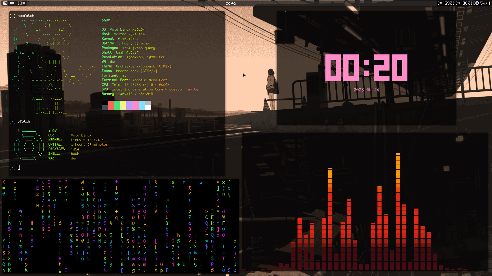
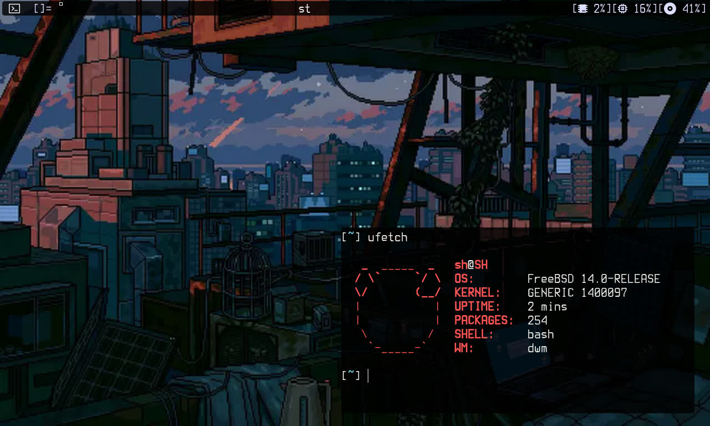
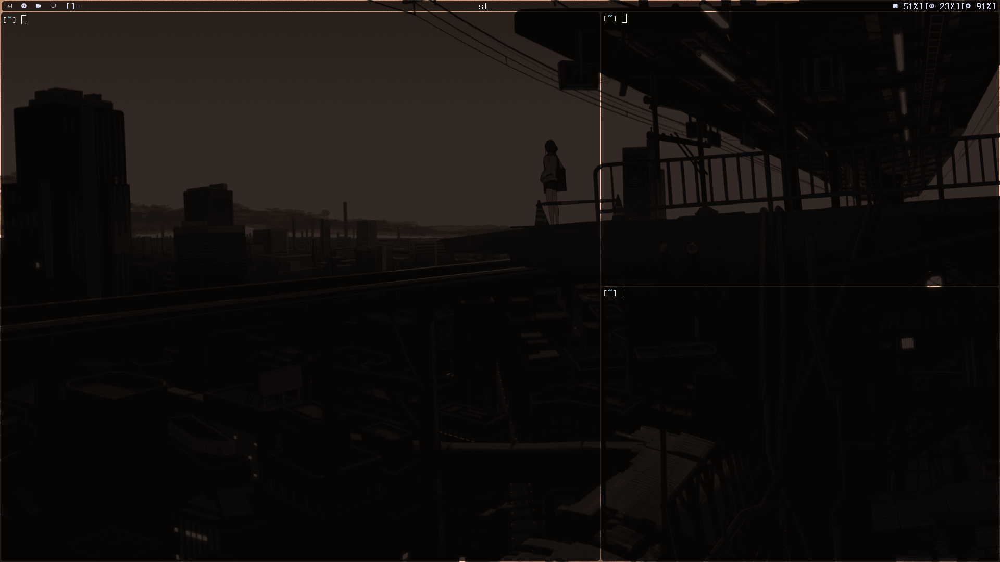
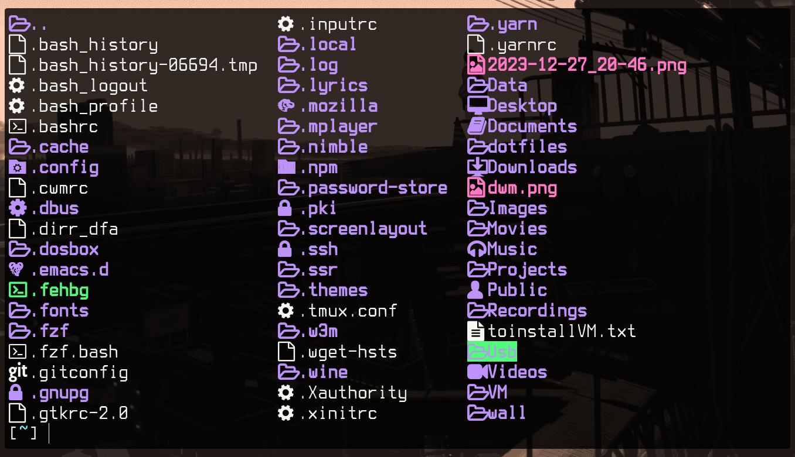
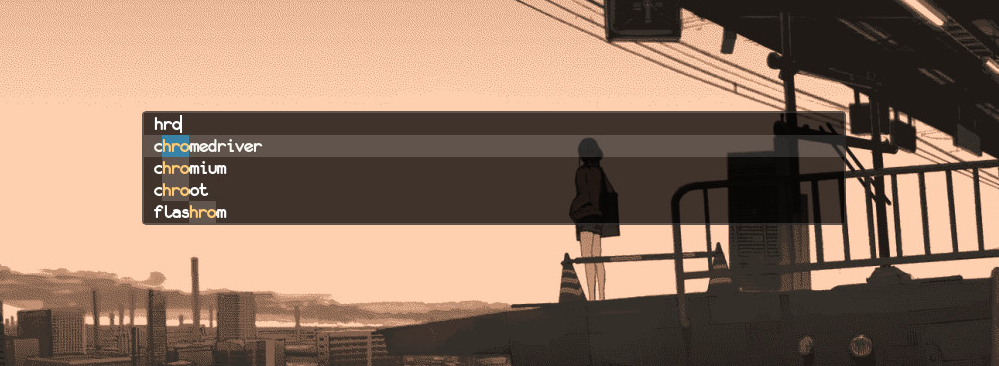
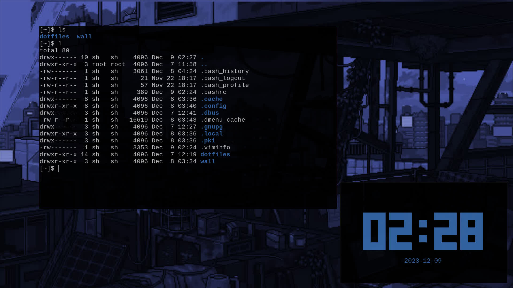

# My dotfiles

## This is my personal configuration, feel free to change it as you see fit your needs.


## Installation

If you want to install my stuff, there are some dependences needed for everything to work.

## Void Linux



### Using the install script

```bash
wget https://raw.githubusercontent.com/elbachir-one/dotfiles/main/install.sh
chmod +x install.sh
./install.sh
```

Note: Don't forget to change the username to your username and the cpu (amd or intel)
The install script only works on Void Linux, and it's a personal script.

Note: Install dependences and copy what you need from the dotfiles.

## FreeBSD



```bash
doas pkg install nerd-fonts feh xorg mpv neovim vim git picom tmux chromium yt-dlp
```
Note: Copy anything from my dots and use it.


### DWM



**Patches included:**

- [Alpha](https://dwm.suckless.org/patches/alpha/)
- [Always center](https://dwm.suckless.org/patches/alwayscenter/)
- [Attach bottom](https://dwm.suckless.org/patches/attachbottom/)
- [Azerty](https://dwm.suckless.org/patches/azerty/) (Specific to my keyboard layout)
- [Bar height](https://dwm.suckless.org/patches/bar_height/)
- [Bar padding](https://dwm.suckless.org/patches/barpadding/)
- [Bidi](https://dwm.suckless.org/patches/bidi/)
- [Cool auto start](https://dwm.suckless.org/patches/cool_autostart/)
- [Cursor wrap](https://dwm.suckless.org/patches/cursorwarp/)
- [Floating border colors](https://dwm.suckless.org/patches/float_border_color/)
- [Full screen](https://dwm.suckless.org/patches/fullscreen/)
- [Functional gaps](https://dwm.suckless.org/patches/functionalgaps/)
- [Hide vacant tags](https://dwm.suckless.org/patches/hide_vacant_tags/)
- [Preserv on restart](https://dwm.suckless.org/patches/preserveonrestart/)
- [Scratch pads](https://dwm.suckless.org/patches/scratchpads/)
- [Swallow](https://dwm.suckless.org/patches/swallow/)
- [True centered title](https://dwm.suckless.org/patches/truecenteredtitle/)
- [Window map](https://dwm.suckless.org/patches/windowmap/)

**Keybindings used in my build of DWM:**

MODKEY=ALT

- Open ST terminal: MODKEY + Shift + Return
- Launch Dmenu: MODKEY + p
- Tiling to Floating: MODKEY + Space
- Restart or Quit DWM: MODKEY + q
- Close any Window: MODKEY + Shift + c
- Scratchpad: MODKEY + s

**For more details see the [web page](https://elbachir-one.github.io/README/src/my_dwm_config.html).**

```bash
cd ~/dotfiles/suckless/dwm/
make
sudo make clean install
```

### ST



**Patches included:**

- [Alpha](https://st.suckless.org/patches/alpha/)
- [Any size](https://st.suckless.org/patches/anysize/)
- [Box draw](https://st.suckless.org/patches/boxdraw/)
- [Clipboard](https://st.suckless.org/patches/clipboard/)
- [Copy URL](https://st.suckless.org/patches/copyurl/)
- [Desktop entry](https://st.suckless.org/patches/desktopentry/)
- [Font 2](https://st.suckless.org/patches/font2/)
- [Glyph](https://st.suckless.org/patches/glyph_wide_support/)
- [Ligatures box draw](https://st.suckless.org/patches/ligatures/)
- [Scroll + Mouse + Inc](https://st.suckless.org/patches/scrollback/)

```bash
cd ~/dotfiles/suckless/st/
make
sudo make clean install
```

### Dmenu



**Patches included:**

- [Alpha](https://tools.suckless.org/dmenu/patches/alpha/)
- [Bidi](https://tools.suckless.org/dmenu/patches/bidi/)
- [Border](https://tools.suckless.org/dmenu/patches/border/)
- [Case Insensitive](https://tools.suckless.org/dmenu/patches/case-insensitive/)
- [Center](https://tools.suckless.org/dmenu/patches/center/)
- [Highlight](https://tools.suckless.org/dmenu/patches/highlight/)
- [High priority](https://tools.suckless.org/dmenu/patches/highpriority/)

```bash
cd ~/dotfiles/suckless/dmenu/
make
sudo make clean install
```

### DWL



The src directory contains some Wayland stuff, like dwl or dmenu for Wayland.
If you want to use my build of DWL,
first check the version of Wlroots available for your system.
This build is specific to Wlroots 17.

**Patches included:**

- [Always Center](https://github.com/djpohly/dwl/wiki/alwayscenter)
- [Atatch Bottom](https://github.com/djpohly/dwl/wiki/attachbottom)
- [Auto Start](https://github.com/djpohly/dwl/wiki/autostart)
- [Ipc](https://github.com/djpohly/dwl/wiki/ipc)
- [Pertag](https://github.com/djpohly/dwl/wiki/pertag)
- [Swallow](https://github.com/djpohly/dwl/wiki/swallow)
- [Vanity Gaps](https://github.com/djpohly/dwl/wiki/vanitygaps)

Install all dependences:

#### Void

```bash
sudo xbps-install wlroots wlroots-devel wayland-protocols wbg wlr-randr xdg-desktop-portal-wlr
```

#### Artix / Arch

```bash
sudo pacman -S wlroots wayland-protocols xdg-desktop-portal-wlr
```

```bash
cd ~/dotfiles/src/dwl/
make
sudo make clean install
```

Note: Keybindings are the same as my DWM.

### Dmenu-wayland

Install dependences: meson, ninja.

```bash
cd ~/dotfiles/src/dmenu-wayland/
mkdir build
meson build
sudo ninja -C build install
```

### Dwl-bar

**Patches included:**

- [Ipc](https://github.com/MadcowOG/dwl-bar/wiki/ipc)
- [Hide Vacant Tags](https://github.com/MadcowOG/dwl-bar/wiki/hide-vacant-tags)

```bash
cd ~/dotfiles/src/dwl-bar/
make
sudo make clean install
```
## Support

- Share the dots if you find them interesting.
- Subscribe to my Youtube Channel [YouTube](https://www.youtube.com/@alphab91) 
- You can also buy me Coffee


[](https://buymeacoffee.com/alphab91)
