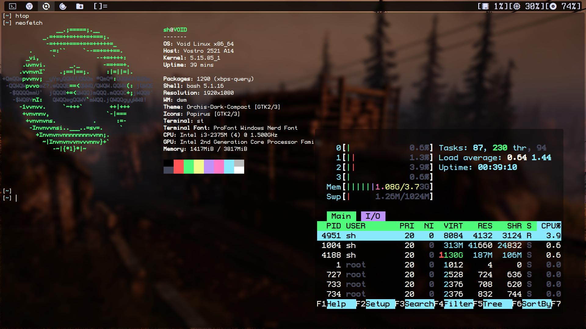

# My dotfiles

### This is my personal configuration, feel free to change it as you see fit your needs.

### Thank you

If you want to install my stuff, there are some dependences needed for everting to work.

### Void Linux

```sh
sudo xbps-install -Sy nerd-fonts-ttf feh xorg libXft-devel libX11-devel libXinerama-devel lsd mpv mpd ncmpcpp zathura neovim vim gvim newsboat picom alacritty lxappearance alsa-utils htop tmux ranger qutebrowser chromium ffmpeg rsync ueberzug mediainfo base-devel clang yt-dlp clipmenu wget curl tree nodejs jq fzf terminus-font scrot ninja networkmanager linux-lts harfbuzz-devel git cmake bash-completion noto-fonts-emoji
```

### FreeBSD

```sh
doas pkg install nerd-fonts feh xorg mpv neovim vim git picom tmux chromium yt-dlp terminus-font bash noto-fonts-emoji
```
